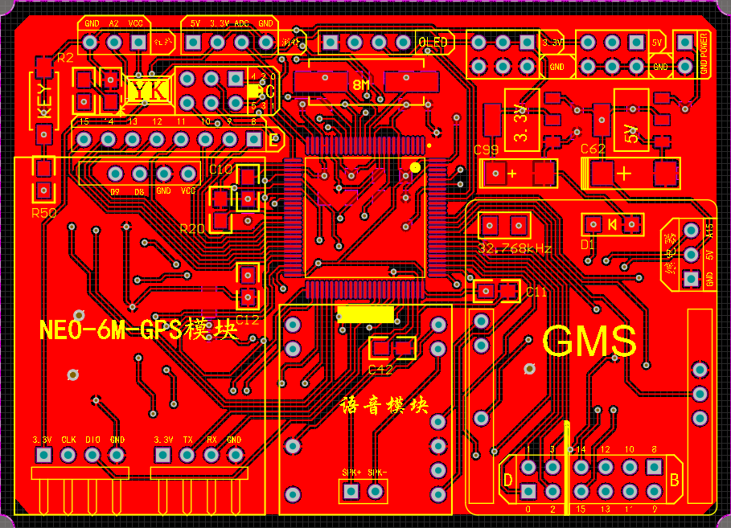
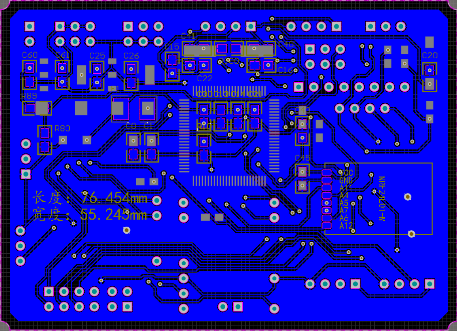
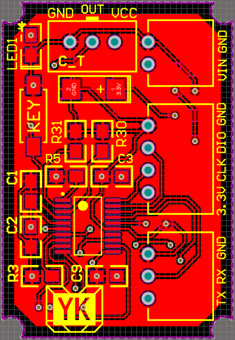
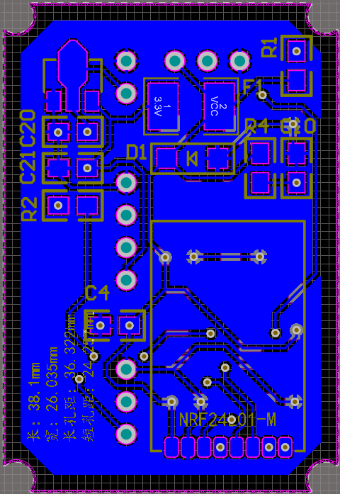
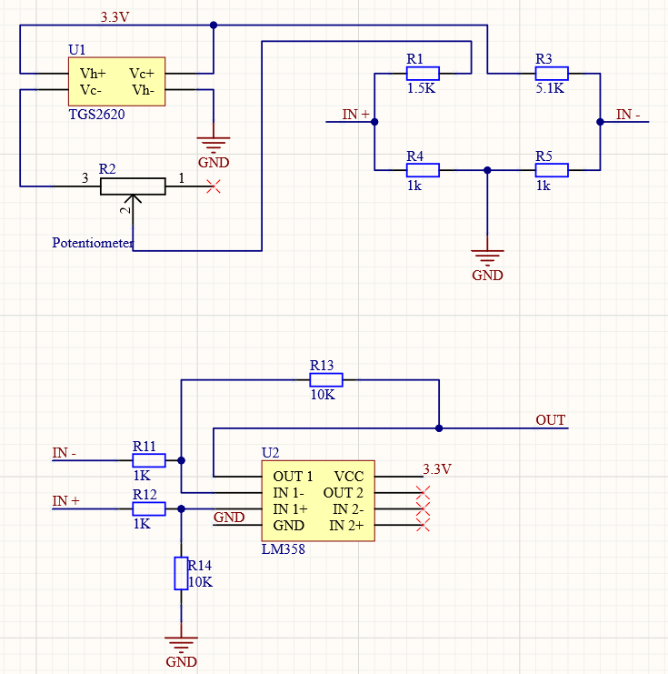
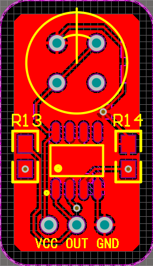
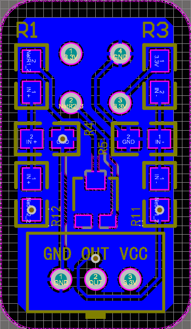

# 智能防酒驾装置

## 一、总体设计方案

智能防酒驾装置由一个主机设备从和三个从机（酒精传感器）组成，主机采用STM32F407作为主控设备，从机采用STM32F030作为主控芯片，主机和从机之间通过NRF24L01进行无线通信。主机负责酒驾情况的判定、通过GPS进行定位、通过GMS向用户发送短信、控制车辆状态、显示设备当前状态并向驾驶员发出语音提示等工作。从机主要负责采集车辆内各处的酒精浓度、向主机报告车辆各处的酒精浓度。酒精传感器采用TGS2620高灵敏度乙醇气体传感器对气体信号进行检测，当空气中有乙醇气体存在时，该气体的浓度越高传感器的电导率也会越高。将电导率的变化转换成与该气体浓度相对应的电压信号输出，根据电压信号进行酒精含量的判断。

该装置的工作流程为：驾驶司机进入车内后，会有一个装有气体传感器的装置强行检测司机的喝酒情况。当酒精浓度较低时，系统无反应并进行语音提示，车子可以正常行驶；但是当酒精浓度过高，超过安全驾驶的酒精浓度范围时，检测装置断开点火开关，使汽车无法发动，并发出语音提示驾驶员请勿酒驾。另外，系统会通过GPS对车辆进行定位，将司机醉酒驾驶的情况和当前位置以短信的形式发送给司机的家属、朋友，或向第三方发送位置，请求代驾。

## 二、硬件电路

#### 1.主机

主机由STM32F407VET6作为主控芯片，将GPS模块、GMS模块、语音模块、NRF24L01无线通信模块、OLED显示模块集成在一起，对外提供继电器、热释电红外模块、酒精传感器和矩阵键盘的接口。主设备采用12V电源进行供电，首先经过MP1584en稳压模块将电压降至5V，为GMS模块、语音模块、继电器进行供电（原定采用AMS1117-5.0进行5V稳压，但由于AMS1117的最大输出电流只有1A，无法满足设备的供电需求）。然后在经过AMS1117-3.3将电压稳压到3.3V，为GPS模块、OLED显示屏、NRF24L01无线通信模块、热释电红外模块进行供电。			

#### 2.从机

从机由STM32F030F4P6作为主控芯片，主要负责对酒精传感器的信号进行采集，并通过NRF24L01将采集到的信号发送给主机做酒驾判断。为了减小从机的体积，从机部分没有采用外部的晶振提供时钟信号，只保留了稳压电路和滤波电路。
			

#### 3.酒精传感器

酒精传感器由TGS2620作为敏感元件，首先让TGS2620输出的电压信号经过惠斯通电桥，形成一组差分信号，然后经过由LM358组成的差分运算放大器，从而获得到空气中酒精浓度的相对变化值。
						

## 三、程序设计

### 主机部分

#### 1、GPS

GPS通过usar3与主机进行通信，波特率为9600。

```c
extern char GPS_positioning ,GPS_Init_OK;
char longitude_char[15],latitude_char[15];
nmea_msg gpsx; 
u8 USART1_TX_BUF[USART3_MAX_RECV_LEN]; 
//********************************************************************
//GPS初始化
//Usart3初始化9600
//GPS配置，只需配置一次，重新上电无需再次配置
//若与GPS通讯失败则一直死循环，无法跳出
//只从GPS模块获取GPGGA的数据
//********************************************************************
void GPS_Init()
{
	usart3_init(9600);
	printf("NEO-6M Setting...");
	while((Ublox_Cfg_Rate(500,1)!=0))	//持续判断,直到可以检查到NEO-6M,且数据保存成功
	{
		while(Ublox_Cfg_Msg(0x00,1));
		while(Ublox_Cfg_Msg(0x01,0));
		while(Ublox_Cfg_Msg(0x02,0));
		while(Ublox_Cfg_Msg(0x03,0));
		while(Ublox_Cfg_Msg(0x04,0));
		while(Ublox_Cfg_Msg(0x05,0));    
		while(Ublox_Cfg_Cfg_Save());	//保存配置  
	}
	printf("GPS_Init_OK\r\n");	
	GPS_Init_OK = 1;
}
//>>>>>>>>>>>>>>>>>>>>>>>>>>>>>>>>>>>>>>>>>>>>>>>>>>>>>>>>>>>>>>>>>END


//********************************************************************
//得到GPS的经纬度
//数据为char型数组
//若没有得到数据则无返回结果
//********************************************************************
void GPS_GetData()
{
	u8 i;
	if(USART3_RX_STA&0X8000)		//接收到一次数据了
	{
		USART3_RX_STA=0;		   		//启动下一次接收
		
		GPS_Analysis(&gpsx,(u8*)USART3_RX_BUF);//分析字符串
		
		if(gpsx.gpssta==1 ||gpsx.gpssta==2 )	//GPS定位成功 
		{
			u8 i;
			
			GPS_positioning = 1;

			Transform_double_to_char(((double)(gpsx.longitude)/10000000-0.003466), longitude_char, 6, 1);
			Transform_double_to_char(((double)(gpsx.latitude)/10000000+0.323707), latitude_char, 6, 1);	
			
			i =strlen(longitude_char);
			longitude_char[i] =gpsx.ewhemi;
			longitude_char[i+1] ='\0';
			
			i =strlen(latitude_char);
			latitude_char[i] =gpsx.nshemi;
			latitude_char[i+1] ='\0';
			
			printf("GPS定位成功\r\n");	
		}
		else if(gpsx.gpssta==0)
		{	
			if(GPS_positioning == 1 )
			{
				GPS_positioning = 2;
				printf("GPS信号弱\r\n");
			}
			else if(GPS_positioning == 0 )
			{
				printf("GPS无信号\r\n");
			}
		}
		gpsx.gpssta = 0;
	}
}
//>>>>>>>>>>>>>>>>>>>>>>>>>>>>>>>>>>>>>>>>>>>>>>>>>>>>>>>>>>>>>>>>>END


//********************************************************************
//浮点型/整型转字符型
//Decimal需转换小数
//Character字符型储存的地址，在主函数定义
//precision保留的精度
//round是否四舍五入，1是，0否
//注意可以转换的长度
//********************************************************************
void Transform_double_to_char(double Decimal, char *Character, short int precision, char round)
{
	int i,x=1;
	int integer ,integer_decimals;
	char temporary_char[10];
	for(i=0;i<precision;i++)
	{
		x *=10;
	}
	integer = (int)Decimal;															//整数部分
	integer_decimals = (int)((Decimal - integer) * x + 0.5*round);
	for(i=0 ;integer>0 ;i++)
	{
		temporary_char[i]= (integer % 10) + '0';
		integer = (int)(integer/10);
	}
	if( i==0)
	{
		temporary_char[i]= '0';
		i++;
	}
	for(x=0;x<i;x++)
	{
		Character[x] =temporary_char[i-x-1];
	}
	memset(temporary_char,NULL,sizeof(temporary_char));
	if(precision!=0)
	{
		Character[x]= '.';
		x++;
		for(i=0 ;i<precision ;i++)
		{
			temporary_char[i]= (integer_decimals % 10) + '0';
			integer_decimals = (int)(integer_decimals/10);
		}
		for(i=0 ;i<precision ;x++,i++)
		{
			Character[x] = temporary_char[precision-i-1];	
		}
	}
	Character[x] ='\0';
}
//>>>>>>>>>>>>>>>>>>>>>>>>>>>>>>>>>>>>>>>>>>>>>>>>>>>>>>>>>>>>>>>>>END
```

#### 2、GMS

```c
#define Number_retries 5
char Phone_number[4][12]={{"XXXXXXXXXXX"},{"XXXXXXXXXXX"},{"XXXXXXXXXXX"},{"XXXXXXXXXXX"}};

char PDU_Phone_number[31] = {"0011000D9168xxxxxxxxxxxx000801"};
char Message_content_original_1[280]={"53D173B0752862376B63572891529A7EFF0C4ED676844F4D7F6E4E3AFF08FF093002"};
char Message_content_original_2[280]={"53D173B0752862376B63572891529A7EFF0C75314E8E0047005000535B9A4F4D59318D25FF0C8BF760A880547CFB8BE5752862378BE295EE5F53524D4F4D7F6E3002"};

extern char longitude_char[15],latitude_char[15];

//********************************************************************
//GSM初始化
//初始化USART2
//配置GMS模式
//初始化未成功一直在死循环中
//********************************************************************
void SIM900A_Init()
{
	u8 i ,Init_OK=0;
	USART2_init(115200);
	while(Init_OK != 3)
	{
		Init_OK = 0;
		for(i=0;i<Number_retries;i++)
		{
			SIM900A_Send_AT( "AT" ,1 );
			if(USART2_Data_seek(USART2_Data ,"OK" ,500))
			{
				Init_OK++;
				break;
			}
		}
		for(i=0;i<Number_retries;i++)
		{
			SIM900A_Send_AT( "AT+CSCS=\"UCS2\"" ,1 );
			if(USART2_Data_seek(USART2_Data ,"OK" ,500))
			{
				Init_OK++;
				break;
			}
		}
		for(i=0;i<Number_retries;i++)
		{
			SIM900A_Send_AT( "AT+CMGF=0" ,1 );	//PDU模式
			if(USART2_Data_seek(USART2_Data, "OK" ,500))
			{
				Init_OK++;
				break;
			}
		}
		if(Init_OK != 3)
		{
			printf("SIM900A_Init失败\r\n");
		}
	}	
	printf("SIM900A_Init成功\r\n");
}
//>>>>>>>>>>>>>>>>>>>>>>>>>>>>>>>>>>>>>>>>>>>>>>>>>>>>>>>>>>>>>>>>>END


//********************************************************************
//SIM执行命令
//0~3发送短信,0~3号联系人
//********************************************************************
char SIM900A_Executive_Command( char number )
{	
	if( number == 0 ||number == 1 ||number == 2 ||number == 3 )
	{
		int i ,Length;
		char Message_content[280];
		char AT_CMGS[4],Data_Length[4];
		char PUD_latitude[50],PUD_longitude[50];
		char PUD_longitude_latitude[100];
		char PUD_comma[5]={"002C"};
		
		PDU_Transform__Phone_number(Phone_number[number]);
			
		if(GPS_positioning != 0)
		{
			PDU_Transform__Message_content(Message_content,Message_content_original_1);
			
			Char_to_Unicode(latitude_char, PUD_latitude );
			Char_to_Unicode(longitude_char, PUD_longitude );
			
			memset(PUD_longitude_latitude,NULL,strlen(PUD_longitude_latitude));
			String_addition(PUD_longitude_latitude ,PUD_latitude ,0);
			String_addition(PUD_longitude_latitude ,PUD_comma ,strlen(PUD_longitude_latitude));
			String_addition(PUD_longitude_latitude ,PUD_longitude ,strlen(PUD_longitude_latitude));
			
			String_addition(Message_content ,PUD_longitude_latitude ,15*4);
		}
		else
		{
			PDU_Transform__Message_content(Message_content,Message_content_original_2);
		}
		Length = strlen(Message_content)/2;
		Transform_int_to_hexadecimal(Length ,Data_Length ,2);
		Transform_double_to_char( Length+15, AT_CMGS, 0, 0);
		
		printf("%s\r\n",PDU_Phone_number);
		printf("%s\r\n",Data_Length);
		printf("%s\r\n",Message_content);
		
		for(i=0;i<Number_retries;i++)
		{
			SIM900A_Send_AT( "AT+CMGS=" ,0 );
			SIM900A_Send_AT( AT_CMGS ,1 );		
			
			if(USART2_Data_seek(USART2_Data ,">" ,500))
			{
				SIM900A_Send_AT( PDU_Phone_number ,0 );
				SIM900A_Send_AT( Data_Length ,0 );
				SIM900A_Send_AT( Message_content ,0 );

				USART_SendData( USART2, 0x1A );
				SIM900A_Send_AT( 0 ,1 );
				if(USART2_Data_seek(USART2_Data ,"ERROR" ,2000))
				{
					printf("发送失败\r\n");
					return 0xFF;
				}
				printf("发送成功\r\n");
				return 0x00;
			}
			else printf("AT+CMGS指令错误\r\n");
		}	
	}
	printf("指令错误\r\n");
	return 0xFF;
}
//>>>>>>>>>>>>>>>>>>>>>>>>>>>>>>>>>>>>>>>>>>>>>>>>>>>>>>>>>>>>>>>>>END


//********************************************************************
//通过串口2发送AT指令
//可以直接发字符串或发数组
//********************************************************************
void SIM900A_Send_AT( char *AT_command ,char over )
{
	for(;*AT_command!='\0';AT_command++)
	{
		while( USART_GetFlagStatus( USART2 , USART_FLAG_TXE ) == 0 );
		USART_SendData( USART2, *AT_command );
	}
	if( over )
	{
		while( USART_GetFlagStatus( USART2 , USART_FLAG_TXE ) == 0 );
		USART_SendData( USART2, 0x0d );//  /r,0x0d，回车的作用只是移动光标至该行的起始位置
		while( USART_GetFlagStatus( USART2 , USART_FLAG_TXE ) == 0 );
		USART_SendData( USART2, 0x0a );//  /n,0x0a，换行至下一行行首起始位置；
	}
	while( USART_GetFlagStatus( USART2 , USART_FLAG_TXE ) == 0 );
}
//>>>>>>>>>>>>>>>>>>>>>>>>>>>>>>>>>>>>>>>>>>>>>>>>>>>>>>>>>>>>>>>>>END


//*******************************************************************
//清空字符串USART2_Data
//*******************************************************************
void USART2_Data_empty()
{
	memset( USART2_Data, 0, sizeof USART2_Data);
	Receive_the_length = 0;
}
//>>>>>>>>>>>>>>>>>>>>>>>>>>>>>>>>>>>>>>>>>>>>>>>>>>>>>>>>>>>>>>>>>END


//*******************************************************************
//检测字符串中是否有指定字符串
//有时清空USART2_Data的数据并返回1，否则返回0
//time_ms:共检测time_ms毫秒
//*******************************************************************
char USART2_Data_seek(char *aentire_array,char *target ,int time_ms)
{
	int i,x,y;
	for(i=0; i<10*time_ms; i++)
	{
		for(x=0,y=0;x<strlen(aentire_array);x++)
		{
			while(*(aentire_array+x+y)==*(target+y))
			{
				y++;
				if(y==strlen(target))
				{
					USART2_Data_empty();
					Receive_the_length = 0;
					return 1;
				}
			}
		}
		delay_us(100);
	}
//	printf("000---%s\r\n",USART2_Data);
	USART2_Data_empty();
	Receive_the_length = 0;
	return 0;
}
//>>>>>>>>>>>>>>>>>>>>>>>>>>>>>>>>>>>>>>>>>>>>>>>>>>>>>>>>>>>>>>>>>END


//*******************************************************************
//将手机号码转换为PDU格式
//*******************************************************************
void PDU_Transform__Phone_number(char *Phone_number_input)
{
	u8 i;
	Phone_number_input[11] = 'F';
	for(i =0 ;i<12 ;i++)
	{
		if( i%2 == 0)
		{
			PDU_Phone_number[i+12] = Phone_number_input[i+1];
		}
		else
		{
			PDU_Phone_number[i+12] = Phone_number_input[i-1];
		}
	}
	Phone_number_input[11] = '\0';
}
//>>>>>>>>>>>>>>>>>>>>>>>>>>>>>>>>>>>>>>>>>>>>>>>>>>>>>>>>>>>>>>>>>END


//*******************************************************************
//生成需要发送的内容
//*******************************************************************
void PDU_Transform__Message_content(char *Message_content_send ,char *Message_content_original)
{
	int i;
	int length;
	for(i =0 ;Message_content_original[i]!='\0' ;i++)
	{
			Message_content_send[i] = Message_content_original[i];
	}
	Message_content_send[i] = '\0';
}
//>>>>>>>>>>>>>>>>>>>>>>>>>>>>>>>>>>>>>>>>>>>>>>>>>>>>>>>>>>>>>>>>>END


//*******************************************************************
//将经纬度转化为Unicode型
//*******************************************************************
void Char_to_Unicode(char *Char, char *Unicode )
{
	int i;
	for(i =0; Char[i] != '\0' ; i++)
	{
		if( Char[i] >='0' && Char[i] <='9')
		{
			Unicode[i*4] ='0';
			Unicode[i*4+1] ='0';
			Unicode[i*4+2] ='3';
			Unicode[i*4+3] =Char[i];
		}
		else if( Char[i] =='.')
		{
			Unicode[i*4] ='0';
			Unicode[i*4+1] ='0';
			Unicode[i*4+2] ='2';
			Unicode[i*4+3] ='E';
		}
		else if( Char[i] =='E' )
		{
			Unicode[i*4] ='0';
			Unicode[i*4+1] ='0';
			Unicode[i*4+2] ='4';
			Unicode[i*4+3] ='5';
		}
		else if( Char[i] =='N' )
		{
			Unicode[i*4] ='0';
			Unicode[i*4+1] ='0';
			Unicode[i*4+2] ='4';
			Unicode[i*4+3] ='E';
		}
		else if( Char[i] ==',' )
		{
			Unicode[i*4] ='0';
			Unicode[i*4+1] ='0';
			Unicode[i*4+2] ='2';
			Unicode[i*4+3] ='C';
		}
		Unicode[(i+1)*4]='\0';
	}
}
//>>>>>>>>>>>>>>>>>>>>>>>>>>>>>>>>>>>>>>>>>>>>>>>>>>>>>>>>>>>>>>>>>END


//*******************************************************************
//字符串内添加字符串
//原字符串String
//需要添加的字符串Add_String
//第Add_location字之后添加
//*******************************************************************
void String_addition(char *String ,char *Add_String ,int Add_location)
{
	u8 i;
	int length_String ,length_Add;
	length_String = strlen(String);
	length_Add = strlen(Add_String);
	
	String[ length_String+length_Add ] ='\0';
	
	for( ;length_String> Add_location ; length_String--)
	{
		String[ length_String-1+length_Add ] = String[ length_String-1 ];
	}
	
	for( ;length_Add>0 ;length_Add--)
	{
		String[ Add_location-1+length_Add ] = Add_String[ length_Add-1 ];
	}
}
//>>>>>>>>>>>>>>>>>>>>>>>>>>>>>>>>>>>>>>>>>>>>>>>>>>>>>>>>>>>>>>>>>END
```

#### 3、NRF24L01

```c
const char Device_1_ADDR[TX_ADR_WIDTH]=	{0xFF,0x10,0x01}; //发送地址
const char Device_2_ADDR[RX_ADR_WIDTH]=	{0xFF,0x20,0X02}; //发送地址  
const char Device_3_ADDR[RX_ADR_WIDTH]=	{0xFF,0x30,0X03}; //发送地址 
const char Device_4_ADDR[RX_ADR_WIDTH]=	{0xFF,0x40,0X04}; //发送地址 

double slave_unit_voltage[3];
short int slave_unit_alcohol_concentration[3];
u8 slave_disconnect[3]={0,0,0};//值为100时断开连接

//********************************************************************
//初始化24L01的IO口
//寄存器初始化配置
//********************************************************************
void NRF24L01_Init(void)
{ 	
//>>>>>>GPIO Init<<<<<<
	{
	GPIO_InitTypeDef GPIO_InitStructure;
	RCC_AHB1PeriphClockCmd(RCC_AHB1Periph_GPIOA, ENABLE);
	
    //CSN	
	GPIO_InitStructure.GPIO_Pin   = GPIO_Pin_4;				
	GPIO_InitStructure.GPIO_Mode  = GPIO_Mode_OUT;
	GPIO_InitStructure.GPIO_OType = GPIO_OType_PP;
	GPIO_InitStructure.GPIO_PuPd  = GPIO_PuPd_UP;
	GPIO_InitStructure.GPIO_Speed = GPIO_Speed_100MHz;
 	GPIO_Init(GPIOA, &GPIO_InitStructure);
	
	//IRQ
	GPIO_InitStructure.GPIO_Pin   = GPIO_Pin_12;				
	GPIO_InitStructure.GPIO_Mode  = GPIO_Mode_IN;
	GPIO_InitStructure.GPIO_OType = GPIO_OType_PP;
	GPIO_InitStructure.GPIO_PuPd  = GPIO_PuPd_UP;
	GPIO_InitStructure.GPIO_Speed = GPIO_Speed_2MHz;
 	GPIO_Init(GPIOA, &GPIO_InitStructure);

	//CE
	GPIO_InitStructure.GPIO_Pin   = GPIO_Pin_11;
	GPIO_InitStructure.GPIO_Mode  = GPIO_Mode_OUT;
	GPIO_InitStructure.GPIO_OType = GPIO_OType_PP;
	GPIO_InitStructure.GPIO_PuPd  = GPIO_PuPd_DOWN;
	GPIO_InitStructure.GPIO_Speed = GPIO_Speed_100MHz;
 	GPIO_Init(GPIOA, &GPIO_InitStructure);
		
	NRF24L01_CE=0;
	NRF24L01_CSN=1;	
	
	NRF24L01_NVIC_Init();
	}
//>>>>>>END<<<<<<
		NRF24L01_Write_Reg(NRF_WRITE_REG+SETUP_AW,0x01);//地址3位
	
	while(NRF24L01_Check());

	NRF24L01_Write_Buf(NRF_WRITE_REG+RX_ADDR_P0,(u8*)Device_1_ADDR,RX_ADR_WIDTH); //设置TX节点地址,主要为了使能ACK

	NRF24L01_Write_Reg(NRF_WRITE_REG+RX_PW_P0,RX_PLOAD_WIDTH);//选择通道0的有效数据宽度
	
  	NRF24L01_Write_Reg(NRF_WRITE_REG+EN_AA,0x01);     //使能通道0~3的自动应答
  	NRF24L01_Write_Reg(NRF_WRITE_REG+EN_RXADDR,0x01); //使能通道0~3的接收地址 
  	NRF24L01_Write_Reg(NRF_WRITE_REG+SETUP_RETR,0x05);//设置自动重发间隔时间:250us + 86us;最大自动重发次数:5次
	NRF24L01_Write_Reg(NRF_WRITE_REG+RF_CH,10);       //设置RF通道为40;所有的模块要求一样
	NRF24L01_Write_Reg(NRF_WRITE_REG+RF_SETUP,0x0f);  //设置TX发射参数,0db增益,2Mbps,低噪声增益开启   	
	NRF24L01_Write_Reg(NRF_WRITE_REG+CONFIG,0x0e);    //配置基本工作模式的参数;
													  //PWR_UP=1,EN_CRC=1,16BIT_CRC,开启所有中断	
	
}
//>>>>>>>>>>>>>>>>>>>>>>>>>>>>>>>>>>>>>>>>>>>>>>>>>>>>>>>>>>>>>>>>>END


//********************************************************************
//NRF24L01自检
//返回值:0，成功;1，失败
//********************************************************************	
u8 NRF24L01_Check(void)
{
	u8 buf[3]={0XA5,0XA5,0XA5},buf2[3];
	u8 i;   	 
	NRF24L01_Write_Buf( NRF_WRITE_REG + TX_ADDR,buf,3);//写入5个字节的地址.
	NRF24L01_Read_Buf( TX_ADDR,buf2,3); //读出写入的地址
	for(i=0;i<3;i++)
	{
		if(buf2[i]!=0XA5)break;
	}
	
	if(i!=3)return 1;//检测24L01错误	
	return 0;		 //检测到24L01
}
//>>>>>>>>>>>>>>>>>>>>>>>>>>>>>>>>>>>>>>>>>>>>>>>>>>>>>>>>>>>>>>>>>END


//********************************************************************
//启动NRF24L01发送一次数据
//txbuf:待发送数据首地址
//返回值:发送完成状况
//********************************************************************	
u8 NRF24L01_TxPacket(u8 *txbuf,const char *TX_addr)
{
	u8 sta;
	
	NRF24L01_Write_Buf(NRF_WRITE_REG+TX_ADDR, (u8*)TX_addr, TX_ADR_WIDTH);//写TX节点地址
	NRF24L01_Write_Buf(WR_TX_PLOAD,txbuf,TX_PLOAD_WIDTH);//写数据到TX BUF  32个字节
	
	NRF24L01_CE=0;
	delay_ms(10);
 	NRF24L01_CE=1;//启动发送	   
	
	while(NRF24L01_IRQ!=0);//等待发送完成
	sta=NRF24L01_Read_Reg(STATUS);  //读取状态寄存器的值	   
	NRF24L01_Write_Reg(NRF_WRITE_REG+STATUS,sta); //清除TX_DS或MAX_RT中断标志
	if(sta&MAX_TX)//达到最大重发次数
	{
		NRF24L01_Write_Reg(FLUSH_TX,0xff);//清除TX FIFO寄存器 
		return MAX_TX; 
	}
	if(sta&TX_OK)//发送完成
	{
		return TX_OK;
	}
	return 0xff;//其他原因发送失败
}
//>>>>>>>>>>>>>>>>>>>>>>>>>>>>>>>>>>>>>>>>>>>>>>>>>>>>>>>>>>>>>>>>>END


//********************************************************************
//启动NRF24L01接收一次数据
//txbuf:待发送数据首地址
//返回值:0，接收完成；其他，错误代码
//********************************************************************
u8 NRF24L01_RxPacket(u8 *rxbuf)
{
	u8 sta;
	while(NRF24L01_IRQ);
	sta=NRF24L01_Read_Reg(STATUS);  //读取状态寄存器的值
	NRF24L01_Write_Reg(NRF_WRITE_REG+STATUS,sta); //清除TX_DS或MAX_RT中断标志
	if(sta&RX_OK)//接收到数据
	{
		NRF24L01_Read_Buf(RD_RX_PLOAD,rxbuf,RX_PLOAD_WIDTH);//读取数据
		NRF24L01_Write_Reg(FLUSH_RX,0xff);//清除RX FIFO寄存器		
		return 0; 
	}	
		
	return 1;//没收到任何数据
}
//>>>>>>>>>>>>>>>>>>>>>>>>>>>>>>>>>>>>>>>>>>>>>>>>>>>>>>>>>>>>>>>>>END


//********************************************************************
//该函数初始化NRF24L01到RX模式
//清空状态标志位
//********************************************************************
void NRF24L01_RX_Mode(void)
{
	NRF24L01_CE=0;	  

	NRF24L01_Write_Reg(NRF_WRITE_REG+STATUS,0x70); 	  //清除中断标志
	NRF24L01_Write_Reg(FLUSH_RX,0xff);				  //清除RX FIFO寄存器
	NRF24L01_Write_Reg(FLUSH_TX,0xff);				  //清除RX FIFO寄存器
	
  	NRF24L01_Write_Reg(NRF_WRITE_REG+CONFIG, 0x0f);//配置基本工作模式的参数;PWR_UP,EN_CRC,16BIT_CRC,接收模式 

  	NRF24L01_CE = 1; //CE为高,进入接收模式 
}
//>>>>>>>>>>>>>>>>>>>>>>>>>>>>>>>>>>>>>>>>>>>>>>>>>>>>>>>>>>>>>>>>>END


//********************************************************************
//该函数初始化NRF24L01到TX模式
//清空状态标志位
//CE为高大于10us,则启动发送.
//********************************************************************	 
void NRF24L01_TX_Mode(void)
{														 
	NRF24L01_CE=0;

	NRF24L01_Write_Reg(NRF_WRITE_REG+STATUS,0x70); 	  //清除中断标志
	NRF24L01_Write_Reg(FLUSH_RX,0xff);				  //清除RX FIFO寄存器
	NRF24L01_Write_Reg(FLUSH_TX,0xff);				  //清除RX FIFO寄存器	

	NRF24L01_Write_Reg(NRF_WRITE_REG+CONFIG,0x0e);    //0x0e配置基本工作模式的参数;PWR_UP,EN_CRC,16BIT_CRC,接收模式,开启所有中断
}
//>>>>>>>>>>>>>>>>>>>>>>>>>>>>>>>>>>>>>>>>>>>>>>>>>>>>>>>>>>>>>>>>>END


//********************************************************************
//SPI写寄存器
//reg:指定寄存器地址
//value:写入的值
//********************************************************************
u8 NRF24L01_Write_Reg(u8 reg,u8 value)
{
	u8 status;	
   	NRF24L01_CSN=0;                 //使能SPI传输
  	status =SPI1_send_receive_data( reg );//发送寄存器号 
  	SPI1_send_receive_data(value);      //写入寄存器的值
  	NRF24L01_CSN=1;                 //禁止SPI传输	
	delay_ms(1);	
  	return(status);       			//返回状态值
}
//>>>>>>>>>>>>>>>>>>>>>>>>>>>>>>>>>>>>>>>>>>>>>>>>>>>>>>>>>>>>>>>>>END


//********************************************************************
//读取SPI寄存器值
//reg:要读的寄存器
//********************************************************************
u8 NRF24L01_Read_Reg(u8 reg)
{
	u8 reg_val;	    
 	NRF24L01_CSN = 0;          //使能SPI传输		
  	SPI1_send_receive_data( reg );   //发送寄存器号
  	reg_val=SPI1_send_receive_data(0XFF);//读取寄存器内容
  	NRF24L01_CSN = 1;          //禁止SPI传输	
	delay_ms(1);
  	return(reg_val);           //返回状态值
}
//>>>>>>>>>>>>>>>>>>>>>>>>>>>>>>>>>>>>>>>>>>>>>>>>>>>>>>>>>>>>>>>>>END


//********************************************************************
//在指定位置读出指定长度的数据
//reg:寄存器(位置)
//*pBuf:数据指针
//len:数据长度
//返回值,此次读到的状态寄存器值 
//********************************************************************
u8 NRF24L01_Read_Buf(u8 reg,u8 *pBuf,u8 len)
{
	u8 status,u8_ctr;	       
  	NRF24L01_CSN = 0;           //使能SPI传输
  	status=SPI1_send_receive_data( reg );//发送寄存器值(位置),并读取状态值   	   
 	for(u8_ctr=0;u8_ctr<len;u8_ctr++) pBuf[u8_ctr]=SPI1_send_receive_data(0XFF);//读出数据
  	NRF24L01_CSN=1;       //关闭SPI传输
	delay_ms(1);
  	return status;        //返回读到的状态值
}
//>>>>>>>>>>>>>>>>>>>>>>>>>>>>>>>>>>>>>>>>>>>>>>>>>>>>>>>>>>>>>>>>>END


//********************************************************************
//在指定位置写指定长度的数据
//reg:寄存器(位置)
//*pBuf:数据指针
//len:数据长度
//返回值,此次读到的状态寄存器值
//********************************************************************
u8 NRF24L01_Write_Buf(u8 reg, u8 *pBuf, u8 len)
{
	u8 status,u8_ctr;	    
 	NRF24L01_CSN = 0;          //使能SPI传输
  	status = SPI1_send_receive_data( reg );//发送寄存器值(位置),并读取状态值
  	for(u8_ctr=0; u8_ctr<len; u8_ctr++) SPI1_send_receive_data(*pBuf++); //写入数据	 
  	NRF24L01_CSN = 1;       //关闭SPI传输
	delay_ms(1);
  	return status;          //返回读到的状态值
	
}
//>>>>>>>>>>>>>>>>>>>>>>>>>>>>>>>>>>>>>>>>>>>>>>>>>>>>>>>>>>>>>>>>>END


//********************************************************************
//NRF24L01数据解析
//********************************************************************
void NRF24L01_Data_Parse(const char *data)
{
	u8 i,x;
	char cache[8],slave;
	if( data[0]=='K' )
	{
		for(i=1,x=0; data[i]!='#'; i++)
		{
			switch(data[i])
			{	
				case 'H' :			for(i++,x=0 ;data[i]!='&' ;i++)	//没有结束
									{
										cache[x] = data[i];
										x++;
									};
									cache[x]='\0';
									slave = Transform_char_to_double(cache);
									slave_disconnect[slave-1] = 0;
//									printf("slave=%d\r\n",slave);
									break;
									
				case 'V' :		
									for(i++,x=0 ;data[i]!='&' ;i++)	//没有结束
									{
										cache[x] = data[i];
										x++;
									};
									cache[x]='\0';
									slave_unit_voltage[slave-1] = Transform_char_to_double(cache);
//									printf("voltage=%lf\r\n",slave_unit_voltage[slave-1]);
									break;
				case 'A' :			for(i++,x=0 ;data[i]!='&' ;i++)	//没有结束
									{
										cache[x] = data[i];
										x++;
									};
									cache[x]='\0';
									slave_unit_alcohol_concentration[slave-1] = Transform_char_to_double(cache);
//									printf("alcohol_concentration=%d\r\n",slave_unit_alcohol_concentration[slave-1]);
									break;
			}
				memset(cache,NULL,strlen(cache));
		}	
	}
}
//>>>>>>>>>>>>>>>>>>>>>>>>>>>>>>>>>>>>>>>>>>>>>>>>>>>>>>>>>>>>>>>>>END


//********************************************************************
//NRF24L01外部中断初始化
//优先级：0-0
//********************************************************************
void NRF24L01_NVIC_Init()
{
	NVIC_InitTypeDef   NVIC_InitStructure;
	EXTI_InitTypeDef   EXTI_InitStructure;

	RCC_APB2PeriphClockCmd(RCC_APB2Periph_SYSCFG, ENABLE);//使能SYSCFG时钟

	SYSCFG_EXTILineConfig(EXTI_PortSourceGPIOA, EXTI_PinSource12);//PA12 连接到中断线12
	
	//外部中断
	EXTI_InitStructure.EXTI_Line = EXTI_Line12;				//LINE0
	EXTI_InitStructure.EXTI_Mode = EXTI_Mode_Interrupt;		//中断事件
	EXTI_InitStructure.EXTI_Trigger = EXTI_Trigger_Falling;	//
	EXTI_InitStructure.EXTI_LineCmd = ENABLE;				//使能
	EXTI_Init(&EXTI_InitStructure);//配置

	//中断配置
	NVIC_InitStructure.NVIC_IRQChannel = EXTI15_10_IRQn;			//外部中断0
	NVIC_InitStructure.NVIC_IRQChannelPreemptionPriority = 1;	//抢占优先级0
	NVIC_InitStructure.NVIC_IRQChannelSubPriority = 0;			//子优先级2
	NVIC_InitStructure.NVIC_IRQChannelCmd = ENABLE;				//使能外部中断通道
	NVIC_Init(&NVIC_InitStructure);//配置

}
//>>>>>>>>>>>>>>>>>>>>>>>>>>>>>>>>>>>>>>>>>>>>>>>>>>>>>>>>>>>>>>>>>END


//********************************************************************
//接收到数据进入中断
//分析接收到的数据
//********************************************************************
void EXTI15_10_IRQHandler()
{
	if(EXTI_GetITStatus(EXTI_Line12))
	{
		char NRF_RX_Data[32];
		NRF24L01_RxPacket(NRF_RX_Data);
//		printf("%s\r\n",NRF_RX_Data);
		NRF24L01_Data_Parse(NRF_RX_Data);
	}
	EXTI_ClearITPendingBit(EXTI_Line12);
}
//>>>>>>>>>>>>>>>>>>>>>>>>>>>>>>>>>>>>>>>>>>>>>>>>>>>>>>>>>>>>>>>>>END
```

#### 4、OLED显示


#### 5、酒精传感器

#### 6、语音模块

#### 7、定时器

### 从机部分

#### 1、NRF24L01

#### 2、酒精传感器


## 四、改进方向